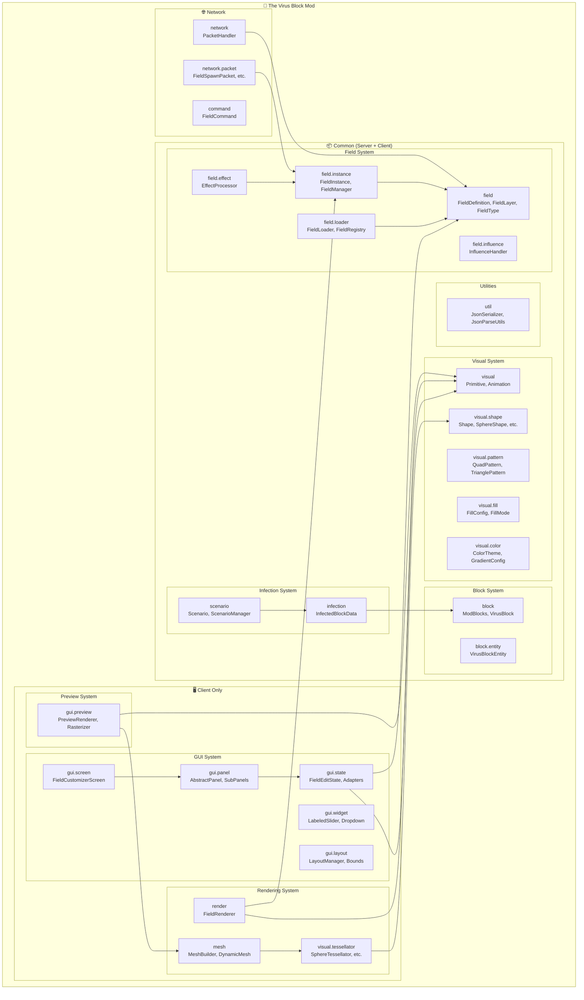

# 🏗️ System Architecture

> Auto-generated from 1022 classes across 147 packages.

## Complete System Overview



## Package Breakdown

### Blocks

| Package | Classes | Key Types |
|---------|---------|------------|
| `net.cyberpunk042.block.core` | 5 | CuredInfectiousCubeBlock, InfectiousCubeBlock, BacteriaBlock, ... |
| `net.cyberpunk042.block.corrupted` | 14 | CorruptedWoodBlock, CorruptedCryingObsidianBlock, CorruptedSandBlock, ... |
| `net.cyberpunk042.block.entity` | 10 | ProgressiveGrowthBlockEntity, SingularityBlockEntity, MatrixCubeBlockEntity, ... |
| `net.cyberpunk042.block.growth` | 1 | ProgressiveGrowthBlock |
| `net.cyberpunk042.block.matrix` | 1 | MatrixCubeBlock |
| `net.cyberpunk042.block.singularity` | 1 | SingularityBlock |
| `net.cyberpunk042.block.virus` | 2 | VirusBlock, VirusBlockProtection |
| `net.cyberpunk042.client.render.blockentity` | 7 | FieldMeshRenderer, ProgressiveGrowthBlockEntityRenderer, MeshFrameAnimator, ... |

### Field

| Package | Classes | Key Types |
|---------|---------|------------|
| `net.cyberpunk042.client.field` | 2 | WarmupOverlay, JoinWarmupManager |
| `net.cyberpunk042.client.field.render` | 19 | PolyhedronRenderer, RaysRenderer, ConeRenderer, ... |
| `net.cyberpunk042.client.field.render.effect` | 6 | RenderWiggleEffect, RenderTwistEffect, RenderEffectChain, ... |
| `net.cyberpunk042.client.field.render.emit` | 8 | RayCageGenerator, EmitLineStrategy, EmitStrategy, ... |
| `net.cyberpunk042.client.render.field` | 1 | GrowthRingFieldRenderer |
| `net.cyberpunk042.command.field` | 7 | FieldEditSubcommand, FieldTestCommand, FieldTypeProviders, ... |
| `net.cyberpunk042.field` | 9 | FieldManager, ClientFieldState, BeamConfig, ... |
| `net.cyberpunk042.field.category` | 3 | ProfileSource, PresetCategory, ProfileCategory |
| `net.cyberpunk042.field.effect` | 5 | EffectConfig, ActiveEffect, EffectType, ... |
| `net.cyberpunk042.field.force` | 1 | ForceFieldConfig |
| `net.cyberpunk042.field.force.core` | 1 | ForceContext |
| `net.cyberpunk042.field.force.field` | 2 | RadialForceField, ForceField |
| `net.cyberpunk042.field.influence` | 15 | ActiveTrigger, TriggerEventDispatcher, FieldEvent, ... |
| `net.cyberpunk042.field.instance` | 7 | FollowConfig, AnchoredFieldInstance, FieldInstance, ... |
| `net.cyberpunk042.field.loader` | 6 | ValidationHelper, ReferenceResolver, JsonParseUtils, ... |
| `net.cyberpunk042.field.primitive` | 4 | PrimitiveLink, Primitive, LinkResolver, ... |
| `net.cyberpunk042.field.profile` | 1 | Profile |
| `net.cyberpunk042.field.registry` | 1 | ProfileRegistry |

### GUI

| Package | Classes | Key Types |
|---------|---------|------------|
| `net.cyberpunk042.client.gui.annotation` | 2 | ShowWhen, ShowWhenConditions |
| `net.cyberpunk042.client.gui.builder` | 4 | Bound, Vec3Binding, BoundPanel, ... |
| `net.cyberpunk042.client.gui.component` | 7 | SelectorBar, TabBar, ScreenComponent, ... |
| `net.cyberpunk042.client.gui.config` | 2 | RenderConfig, GuiConfig |
| `net.cyberpunk042.client.gui.layout` | 10 | LayoutFactory, Bounds, LayoutManager, ... |
| `net.cyberpunk042.client.gui.panel` | 8 | PrimitivePanel, QuickPanel, AbstractPanel, ... |
| `net.cyberpunk042.client.gui.panel.layout` | 3 | SingleColumnLayout, ProfilesPanelLayout, DualColumnLayout |
| `net.cyberpunk042.client.gui.panel.service` | 1 | ProfileActionService |
| `net.cyberpunk042.client.gui.panel.sub` | 18 | TriggerSubPanel, BindingsSubPanel, ForceSubPanel, ... |
| `net.cyberpunk042.client.gui.preview` | 6 | PreviewFboRenderer, PreviewConfig, FramebufferFboAccess, ... |
| `net.cyberpunk042.client.gui.render` | 1 | TestFieldRenderer |
| `net.cyberpunk042.client.gui.schema` | 4 | SchemaContentBuilder, EffectSchemaRegistry, ParameterSpec, ... |
| `net.cyberpunk042.client.gui.screen` | 3 | FieldCustomizerScreen, LogViewerScreen, TabType |
| `net.cyberpunk042.client.gui.shape` | 4 | RayCompatibilityHint, ShapeControlBuilder, ShapePerformanceHint, ... |
| `net.cyberpunk042.client.gui.state` | 15 | RendererCapabilities, RequiresFeature, AppearanceState, ... |
| `net.cyberpunk042.client.gui.state.adapter` | 20 | StateCategory, AbstractAdapter, ShockwaveConfig, ... |
| `net.cyberpunk042.client.gui.state.manager` | 7 | StateManager, LayerManager, ProfileManager, ... |
| `net.cyberpunk042.client.gui.util` | 11 | GuiConfigPersistence, GuiLayout, GuiKeyboardNav, ... |
| `net.cyberpunk042.client.gui.visibility` | 1 | WidgetVisibilityResolver |
| `net.cyberpunk042.client.gui.widget` | 18 | ColorButton, PanelWrapper, LabeledSlider, ... |
| `net.cyberpunk042.network.gui` | 16 | ProfileLoadC2SPayload, ProfileSaveC2SPayload, ShockwaveTriggerS2CPayload, ... |

### Infection

| Package | Classes | Key Types |
|---------|---------|------------|
| `net.cyberpunk042.block.virus` | 2 | VirusBlock, VirusBlockProtection |
| `net.cyberpunk042.infection` | 18 | SingularityState, TierFeatureGroup, VirusEventType, ... |
| `net.cyberpunk042.infection.api` | 16 | BasicSingularityContext, VirusSchedulerMetrics, NoopEffectBus, ... |
| `net.cyberpunk042.infection.collapse` | 2 | NoopCollapseBroadcastManager, BufferedCollapseBroadcastManager |
| `net.cyberpunk042.infection.command` | 1 | CommandFacade |
| `net.cyberpunk042.infection.controller.phase` | 7 | ResetPhaseHandler, DormantPhaseHandler, CollapsePhaseHandler, ... |
| `net.cyberpunk042.infection.events` | 12 | RingPulseEvent, CollapseChunkVeilEvent, GrowthForceEvent, ... |
| `net.cyberpunk042.infection.mutation` | 1 | BlockMutationHelper |
| `net.cyberpunk042.infection.orchestrator` | 8 | IWorldCallbacks, PhaseManager, WorldOrchestrator, ... |
| `net.cyberpunk042.infection.profile` | 9 | CollapseFillProfile, DimensionProfileRegistry, CollapseFillShape, ... |
| `net.cyberpunk042.infection.scenario` | 10 | GuardianBeamManager, EffectPaletteConfig, ScenarioEffectBehavior, ... |
| `net.cyberpunk042.infection.service` | 48 | CollapseSnapshotService, InfectionLifecycleService, ConfigService, ... |
| `net.cyberpunk042.infection.singularity` | 6 | BulkFillHelper, SingularityDiagnostics, SingularityExecutionSettings, ... |
| `net.cyberpunk042.infection.state` | 6 | InfectionState, SingularityModule, TierModule, ... |

### Network

| Package | Classes | Key Types |
|---------|---------|------------|
| `net.cyberpunk042.client.command` | 5 | FieldFragmentCommands, LogViewerCommand, FieldProfileCommands, ... |
| `net.cyberpunk042.client.command.util` | 4 | FieldPath, CommandScanner, FieldEditKnob, ... |
| `net.cyberpunk042.client.network` | 2 | GuiClientHandlers, GuiPacketSender |
| `net.cyberpunk042.command` | 11 | VirusDebugCommands, VirusStatsCommand, InfectionSubcommands, ... |
| `net.cyberpunk042.command.field` | 7 | FieldEditSubcommand, FieldTestCommand, FieldTypeProviders, ... |
| `net.cyberpunk042.command.util` | 16 | EnumSuggester, CommandTargetResolver, ProfileDescriber, ... |
| `net.cyberpunk042.infection.command` | 1 | CommandFacade |
| `net.cyberpunk042.network` | 22 | VirusBlockTelemetryPayload, ShieldFieldSpawnPayload, HelmetHudPayload, ... |
| `net.cyberpunk042.network.gui` | 16 | ProfileLoadC2SPayload, ProfileSaveC2SPayload, ShockwaveTriggerS2CPayload, ... |
| `net.cyberpunk042.network.shader` | 2 | ShaderTimeSyncS2CPayload, ShaderTimeSyncService |

### Rendering

| Package | Classes | Key Types |
|---------|---------|------------|
| `net.cyberpunk042.client.field.render` | 19 | PolyhedronRenderer, RaysRenderer, ConeRenderer, ... |
| `net.cyberpunk042.client.field.render.effect` | 6 | RenderWiggleEffect, RenderTwistEffect, RenderEffectChain, ... |
| `net.cyberpunk042.client.field.render.emit` | 8 | RayCageGenerator, EmitLineStrategy, EmitStrategy, ... |
| `net.cyberpunk042.client.gui.render` | 1 | TestFieldRenderer |
| `net.cyberpunk042.client.render` | 8 | CorruptedFireTextures, SingularityFieldController, VirusFluidRenderers, ... |
| `net.cyberpunk042.client.render.beam` | 1 | GrowthBeamRenderer |
| `net.cyberpunk042.client.render.blockentity` | 7 | FieldMeshRenderer, ProgressiveGrowthBlockEntityRenderer, MeshFrameAnimator, ... |
| `net.cyberpunk042.client.render.entity` | 1 | CorruptedWormRenderer |
| `net.cyberpunk042.client.render.feature` | 1 | CompositeElytraFeatureRenderer |
| `net.cyberpunk042.client.render.field` | 1 | GrowthRingFieldRenderer |
| `net.cyberpunk042.client.render.item` | 1 | ProgressiveGrowthItemRenderer |
| `net.cyberpunk042.client.render.util` | 1 | BeaconBeamRenderer |
| `net.cyberpunk042.client.visual.mesh` | 20 | TorusTessellator, RaysTessellator, TravelEffectComputer, ... |
| `net.cyberpunk042.client.visual.mesh.ray` | 9 | RaySphericalTessellator, RayPositioner, RayTypeTessellatorRegistry, ... |
| `net.cyberpunk042.client.visual.mesh.ray.arrangement` | 5 | ArrangementStrategy, ParallelArrangement, ArrangementFactory, ... |
| `net.cyberpunk042.client.visual.mesh.ray.distribution` | 6 | DistributionResult, StochasticDistribution, DistributionFactory, ... |
| `net.cyberpunk042.client.visual.mesh.ray.flow` | 7 | FlowPhaseStage, FlowFlickerStage, FlowContext, ... |
| `net.cyberpunk042.client.visual.mesh.ray.geometry` | 24 | CurvatureStrategy, ZigzagLineShape, SCurveLineShape, ... |
| `net.cyberpunk042.client.visual.mesh.ray.geometry3d` | 5 | GeoPolarSurfaceGenerator, GeoNoDeformation, GeoDeformationStrategy, ... |
| `net.cyberpunk042.client.visual.mesh.ray.layer` | 7 | LayerModeFactory, LayerModeStrategy, VerticalLayerMode, ... |
| `net.cyberpunk042.client.visual.mesh.ray.tessellation` | 3 | TessEdgeModeFactory, TessEdgeResult, RadiativeInteractionFactory |
| `net.cyberpunk042.client.visual.render` | 5 | RenderLayerFactory, PostFxPipeline, FieldRenderLayers, ... |
| `net.cyberpunk042.client.visual.render.target` | 2 | HdrTargetFactory, TextureFormat |

### Visual

| Package | Classes | Key Types |
|---------|---------|------------|
| `net.cyberpunk042.client.visual` | 2 | ClientFieldManager, PersonalFieldTracker |
| `net.cyberpunk042.client.visual.animation` | 2 | AnimationApplier, WaveDeformer |
| `net.cyberpunk042.client.visual.blend` | 1 | BlendEquationManager |
| `net.cyberpunk042.client.visual.camera` | 1 | CameraUtils |
| `net.cyberpunk042.client.visual.effect` | 13 | FieldVisualRegistry, FieldVisualConfig, BlendEquation, ... |
| `net.cyberpunk042.client.visual.effect.uniform` | 1 | FieldVisualUniformBinder |
| `net.cyberpunk042.client.visual.mesh` | 20 | TorusTessellator, RaysTessellator, TravelEffectComputer, ... |
| `net.cyberpunk042.client.visual.mesh.ray` | 9 | RaySphericalTessellator, RayPositioner, RayTypeTessellatorRegistry, ... |
| `net.cyberpunk042.client.visual.mesh.ray.arrangement` | 5 | ArrangementStrategy, ParallelArrangement, ArrangementFactory, ... |
| `net.cyberpunk042.client.visual.mesh.ray.distribution` | 6 | DistributionResult, StochasticDistribution, DistributionFactory, ... |
| `net.cyberpunk042.client.visual.mesh.ray.flow` | 7 | FlowPhaseStage, FlowFlickerStage, FlowContext, ... |
| `net.cyberpunk042.client.visual.mesh.ray.geometry` | 24 | CurvatureStrategy, ZigzagLineShape, SCurveLineShape, ... |
| `net.cyberpunk042.client.visual.mesh.ray.geometry3d` | 5 | GeoPolarSurfaceGenerator, GeoNoDeformation, GeoDeformationStrategy, ... |
| `net.cyberpunk042.client.visual.mesh.ray.layer` | 7 | LayerModeFactory, LayerModeStrategy, VerticalLayerMode, ... |
| `net.cyberpunk042.client.visual.mesh.ray.tessellation` | 3 | TessEdgeModeFactory, TessEdgeResult, RadiativeInteractionFactory |
| `net.cyberpunk042.client.visual.render` | 5 | RenderLayerFactory, PostFxPipeline, FieldRenderLayers, ... |
| `net.cyberpunk042.client.visual.render.target` | 2 | HdrTargetFactory, TextureFormat |
| `net.cyberpunk042.client.visual.shader` | 21 | ShockwaveTestPipelineArchive, DepthTestShader, VirusBlockUniformBinder, ... |
| `net.cyberpunk042.client.visual.shader.shockwave` | 7 | ShockwaveTestPresets, ShockwaveController, ShockwaveVec4Types, ... |
| `net.cyberpunk042.client.visual.shader.util` | 3 | ShaderPreprocessor, ShaderWarmupService, ShaderLoaderCacheHelper |
| `net.cyberpunk042.client.visual.transform` | 3 | FacingResolver, BillboardResolver, TransformApplier |
| `net.cyberpunk042.client.visual.ubo` | 6 | BaseUBOBinder, ReflectiveUBOWriter, UBORegistry, ... |
| `net.cyberpunk042.client.visual.ubo.annotation` | 5 | Vec4Array, Floats, UBOStruct, ... |
| `net.cyberpunk042.client.visual.ubo.base` | 5 | MaterialUBO, ObjectUBO, LightUBO, ... |
| `net.cyberpunk042.visual.animation` | 30 | EaseFunction, ColorCycleConfig, WiggleMode, ... |
| `net.cyberpunk042.visual.appearance` | 10 | GradientDirection, ColorContext, AlphaRange, ... |
| `net.cyberpunk042.visual.color` | 4 | ColorTheme, ColorThemeRegistry, ColorMath, ... |
| `net.cyberpunk042.visual.effect` | 2 | HorizonEffect, CoronaEffect |
| `net.cyberpunk042.visual.energy` | 6 | EnergyFlicker, EnergyInteractionType, package-info, ... |
| `net.cyberpunk042.visual.fill` | 11 | FillConfig, CageOptions, FillMode, ... |
| `net.cyberpunk042.visual.layer` | 1 | BlendMode |
| `net.cyberpunk042.visual.pattern` | 15 | DynamicSegmentPattern, DynamicSectorPattern, DynamicTrianglePattern, ... |
| `net.cyberpunk042.visual.shape` | 38 | JetPrecession, FieldDeformationMode, CylinderShape, ... |
| `net.cyberpunk042.visual.transform` | 13 | AnchorResolver, TransformStack, AnimatedTransform, ... |
| `net.cyberpunk042.visual.util` | 2 | FieldColor, FieldMath |
| `net.cyberpunk042.visual.validation` | 2 | Range, ValueRange |
| `net.cyberpunk042.visual.visibility` | 3 | MaskType, VisibilityMaskApplier, VisibilityMask |

## Data Flow

```
┌─────────────────────────────────────────────────────────────────┐
│                        USER INTERACTION                          │
└─────────────────────────────┬───────────────────────────────────┘
                              │
                              ▼
┌─────────────────────────────────────────────────────────────────┐
│  FieldCustomizerScreen (GUI)                                     │
│  ├─ HeaderBar, StatusBar                                         │
│  ├─ Panels: ProfilesPanel, ShapeSubPanel, FillSubPanel, etc.    │
│  └─ Widgets: LabeledSlider, DropdownWidget, etc.                 │
└─────────────────────────────┬───────────────────────────────────┘
                              │
                              ▼
┌─────────────────────────────────────────────────────────────────┐
│  FieldEditState                                                   │
│  ├─ Adapters: ShapeAdapter, FillAdapter, AnimationAdapter, etc. │
│  ├─ Managers: LayerManager, ProfileManager, TriggerManager      │
│  └─ Serialization: SerializationManager                          │
└─────────────────────────────┬───────────────────────────────────┘
                              │
                              ▼
┌─────────────────────────────────────────────────────────────────┐
│  FieldDefinition (Serializable Data Model)                       │
│  ├─ FieldLayer[] (primitives, transform, animation)             │
│  ├─ Modifiers, FollowConfig, LifecycleConfig                    │
│  └─ TriggerConfig[]                                              │
└───────────┬─────────────────────────────────┬───────────────────┘
            │                                 │
            ▼                                 ▼
┌───────────────────────┐       ┌───────────────────────────────┐
│  JSON File Storage    │       │  Network (FieldSpawnPacket)   │
│  field_profiles/      │       │  → Server ↔ Clients           │
└───────────┬───────────┘       └───────────────┬───────────────┘
            │                                   │
            ▼                                   ▼
┌─────────────────────────────────────────────────────────────────┐
│  FieldRegistry (Server-side Source of Truth)                     │
│  └─ FieldLoader → ReferenceResolver → DefaultsProvider          │
└─────────────────────────────┬───────────────────────────────────┘
                              │
                              ▼
┌─────────────────────────────────────────────────────────────────┐
│  FieldManager (Active Instance Management)                       │
│  └─ FieldInstance (per-entity: position, radius, state)        │
│     └─ TriggerProcessor, EffectProcessor                        │
└─────────────────────────────┬───────────────────────────────────┘
                              │
                              ▼
┌─────────────────────────────────────────────────────────────────┐
│  ClientFieldState (Client-side Rendering State)                  │
│  └─ FieldRenderer                                                │
│     ├─ MeshBuilder → Tessellators → DynamicMesh                 │
│     └─ RenderLayers → GPU                                        │
└─────────────────────────────────────────────────────────────────┘
```

## Key Integration Points

| Class | Role | Connects To |
|-------|------|-------------|
| `FieldDefinition` | Central data structure | GUI, Storage, Network, Registry |
| `FieldEditState` | GUI adapter layer | All Adapters, FieldDefinition |
| `FieldRegistry` | Server source of truth | FieldLoader, FieldManager |
| `FieldInstance` | Active field entity | FieldManager, TriggerProcessor |
| `MeshBuilder` | Geometry generation | Tessellators, DynamicMesh |
| `FieldRenderer` | GPU rendering | ClientFieldState, RenderLayers |
