# GUI System

> Complete graphical user interface architecture.

**108 classes** across 10 packages.

## Architecture

```mermaid
classDiagram
    class AbstractPanel {
        <<abstract>>
        +isFeatureSupported() boolean
        +getDisabledTooltip() String
        +setBounds(...) void
        +setBoundsQuiet(...) void
        +getBounds() Bounds
    }
    class ProfilesPanel {
        +setDualBounds(...) void
        +isDualMode() boolean
        +init(...) void
        +tick() void
        +render(...) void
    }
    class ShapeSubPanel {
        +setWarningCallback(...) void
        +setShapeChangedCallback(...) void
        +init(...) void
        +rebuildForCurrentShape() void
        +tick() void
    }
    class LabeledSlider {
        +getValue() float
        +setValue(...) void
        +builder(...) Builder
    }
    class PresetConfirmDialog {
        +show(...) void
        +hide() void
        +isVisible() boolean
        +render(...) void
        +mouseClicked(...) boolean
    }
    class ExpandableSection {
        +toggle() void
        +setOnToggle(...) void
        +isExpanded() boolean
        +setContentHeight(...) void
        +getTotalHeight() int
    }
    class ModalDialog {
        +size(...) ModalDialog
        +content(...) ModalDialog
        +addAction(...) ModalDialog
        +addAction(...) ModalDialog
        +onClose(...) ModalDialog
    }
    class ConfirmDialog {
        +unsavedChanges(...) ConfirmDialog
        +delete(...) ConfirmDialog
        +show(...) void
        +getLegacyInstance() ConfirmDialog
        +isLegacyVisible() boolean
    }
    class DropdownWidget {
        +getSelected() T
        +setSelected(...) void
        +setSelectedIndex(...) void
        +onClick(...) void
        +renderWidget(...) void
    }
    class FieldEditState {
        +layers() LayerManager
        +profiles() ProfileManager
        +bindings() BindingsManager
        +triggers() TriggerManager
        +serialization() SerializationManager
    }
    class AbstractAdapter {
        <<abstract>>
        +get(...) Object
        +set(...) void
        +paths() Set
        +reset() void
    }
    class TransformAdapter {
        +category() String
        +loadFrom(...) void
        +saveTo(...) void
        +transform() Transform
        +setTransform(...) void
    }
    class PrimitiveAdapter {
        <<interface>>
    }
    class ShockwaveAdapter {
        +category() String
        +get(...) Object
        +set(...) void
        +syncToPostEffect() void
        +config() ShockwaveConfig
    }
    class ArrangementAdapter {
        +category() String
        +loadFrom(...) void
        +saveTo(...) void
        +get(...) Object
        +set(...) void
    }
    class FieldVisualAdapter {
        +category() String
        +get(...) Object
        +set(...) void
        +isEnabled() boolean
        +sourceRef() String
    }
    class VisibilityAdapter {
        +category() String
        +loadFrom(...) void
        +saveTo(...) void
        +mask() VisibilityMask
        +setMask(...) void
    }
    class LinkAdapter {
        +category() String
        +loadFrom(...) void
        +saveTo(...) void
        +get(...) Object
        +set(...) void
    }
    class TriggerAdapter {
        +category() String
        +loadFrom(...) void
        +saveTo(...) void
        +get(...) Object
        +set(...) void
    }
    class FillAdapter {
        +category() String
        +loadFrom(...) void
        +saveTo(...) void
        +get(...) Object
        +set(...) void
    }
    class MagicCircleAdapter {
        +category() String
        +get(...) Object
        +set(...) void
        +syncToPostEffect() void
        +config() MagicCircleConfig
    }
    class AppearanceAdapter {
        +category() String
        +loadFrom(...) void
        +saveTo(...) void
        +appearance() AppearanceState
        +setAppearance(...) void
    }
    class AnimationAdapter {
        +category() String
        +loadFrom(...) void
        +saveTo(...) void
        +spin() SpinConfig
        +setSpin(...) void
    }
    class ShapeAdapter {
        +category() String
        +loadFrom(...) void
        +saveTo(...) void
        +currentShape() Shape
        +shapeType() String
    }
    class Bounds {
        <<record>>
        +right() int
        +bottom() int
        +centerX() int
        +centerY() int
        +isEmpty() boolean
    }
    class LayoutManager {
        <<interface>>
    }
    class GuiMode {
        <<enumeration>>
    }
    class StatusBar {
        +setBounds(...) void
        +showMessage(...) void
        +setWarning(...) void
        +clearWarning() void
        +render(...) void
    }
    class FieldCustomizerScreen {
        +showColorInputModal(...) void
        +tick() void
        +render(...) void
        +mouseScrolled(...) boolean
        +mouseClicked(...) boolean
    }
    class TabType {
        <<enumeration>>
    }
    class SliderWidget
    class ButtonWidget
    class Screen
    class Builder
    class Screenparent
    class T
    class Objectvalue
    class Primitivesource
    class Objectv
    class Boundsbounds
    AbstractAdapter --> Objectvalue : uses
    AbstractAdapter --> T : returns
    AbstractAdapter --> TdefaultValue : uses
    AbstractAdapter --> Tvalue : uses
    AbstractAdapter <|-- AnimationAdapter
    AbstractAdapter <|-- AppearanceAdapter
    AbstractAdapter <|-- ArrangementAdapter
    AbstractAdapter <|-- FieldVisualAdapter
    AbstractAdapter <|-- FillAdapter
    AbstractAdapter <|-- LinkAdapter
    AbstractAdapter <|-- MagicCircleAdapter
    AbstractAdapter <|-- ShapeAdapter
    AbstractAdapter <|-- ShockwaveAdapter
    AbstractAdapter <|-- TransformAdapter
    AbstractAdapter <|-- TriggerAdapter
    AbstractAdapter <|-- VisibilityAdapter
    AbstractPanel --> Bounds : bounds
    AbstractPanel --> ExpandableSection : sections
    AbstractPanel --> FieldEditState : state
    AbstractPanel --> Screen : parent
    AbstractPanel <|-- ProfilesPanel
    AbstractPanel <|-- ShapeSubPanel
    AnimationAdapter --> AlphaPulseConfig : alphaPulse
    AnimationAdapter --> PulseConfig : pulse
    AnimationAdapter --> SpinConfig : spin
    AnimationAdapter --> WobbleConfig : wobble
    AppearanceAdapter --> AppearanceState : appearance
    AppearanceAdapter --> AppearanceState : returns
    AppearanceAdapter --> PrimitiveBuilderbuilder : uses
    AppearanceAdapter --> Primitivesource : uses
    ArrangementAdapter --> ArrangementConfig : arrangement
    ArrangementAdapter --> Objectvalue : uses
    ArrangementAdapter --> PrimitiveBuilderbuilder : uses
    ArrangementAdapter --> Primitivesource : uses
    ButtonWidget <|-- DropdownWidget
    ConfirmDialog --> DrawContextcontext : uses
    ConfirmDialog --> RunnableonConfirm : uses
    ConfirmDialog --> Screenparent : uses
    ConfirmDialog --> Type : type
    DropdownWidget --> T : labelProvider
    DropdownWidget --> T : onSelect
    DropdownWidget --> T : options
    DropdownWidget --> TextRenderer : textRenderer
    ExpandableSection --> DrawContextcontext : uses
    ExpandableSection --> TextRenderertextRenderer : uses
    FieldCustomizerScreen --> FieldEditState : state
    FieldCustomizerScreen --> GuiMode : mode
    FieldCustomizerScreen --> HeaderBar : headerBar
    FieldCustomizerScreen --> LayoutManager : layout
    FieldEditState --> AnimationAdapter : animationAdapter
    FieldEditState --> FillAdapter : fillAdapter
    FieldEditState --> ShapeAdapter : shapeAdapter
    FieldEditState --> TransformAdapter : transformAdapter
    FieldVisualAdapter --> AnimParams : anim
    FieldVisualAdapter --> AnimTimingParams : animTiming
    FieldVisualAdapter --> ColorParams : colors
    FieldVisualAdapter --> CoreEdgeParams : coreEdge
    FillAdapter --> FillConfig : fill
    FillAdapter --> Objectvalue : uses
    FillAdapter --> PrimitiveBuilderbuilder : uses
    FillAdapter --> Primitivesource : uses
    LabeledSlider --> Builder : returns
    LayoutManager --> Bounds : returns
    LayoutManager --> DrawContextcontext : uses
    LayoutManager --> GuiMode : returns
    LinkAdapter --> Objectvalue : uses
    LinkAdapter --> PrimitiveBuilderbuilder : uses
    LinkAdapter --> PrimitiveLink : link
    LinkAdapter --> Primitivesource : uses
    MagicCircleAdapter --> MagicCircleConfig : config
    MagicCircleAdapter --> MagicCircleConfig : returns
    MagicCircleAdapter --> Objectv : uses
    MagicCircleAdapter --> Objectvalue : uses
    ModalDialog --> ActionButton : actions
    ModalDialog --> Bounds : contentBounds
    ModalDialog --> Bounds : dialogBounds
    ModalDialog --> TextRenderer : textRenderer
    PresetConfirmDialog --> DrawContextcontext : uses
    PrimitiveAdapter --> Objectvalue : uses
    PrimitiveAdapter --> PrimitiveBuilderbuilder : uses
    PrimitiveAdapter --> Primitivesource : uses
    PrimitiveAdapter <|.. AnimationAdapter
    PrimitiveAdapter <|.. AppearanceAdapter
    PrimitiveAdapter <|.. ArrangementAdapter
    PrimitiveAdapter <|.. FillAdapter
    PrimitiveAdapter <|.. LinkAdapter
    PrimitiveAdapter <|.. ShapeAdapter
    PrimitiveAdapter <|.. TransformAdapter
    PrimitiveAdapter <|.. TriggerAdapter
    PrimitiveAdapter <|.. VisibilityAdapter
    ProfilesPanel --> ProfileActionService : actionService
    ProfilesPanel --> ProfileEntry : allProfiles
    ProfilesPanel --> ProfileEntry : filteredProfiles
    ProfilesPanel --> ProfilesPanelLayout : layout
    Screen <|-- FieldCustomizerScreen
    ShapeAdapter --> CylinderShape : cylinder
    ShapeAdapter --> PrismShape : prism
    ShapeAdapter --> RingShape : ring
    ShapeAdapter --> SphereShape : sphere
    ShapeSubPanel --> BiConsumer : warningCallback
    ShapeSubPanel --> CyclingButtonWidget : fragmentDropdown
    ShapeSubPanel --> CyclingButtonWidget : patternFaces
    ShapeSubPanel --> CyclingButtonWidget : shapeTypeDropdown
    ShockwaveAdapter --> Objectv : uses
    ShockwaveAdapter --> Objectvalue : uses
    ShockwaveAdapter --> ShockwaveConfig : config
    ShockwaveAdapter --> ShockwaveConfig : returns
    SliderWidget <|-- LabeledSlider
    StateChangeListener --> ChangeTypechangeType : uses
    StatusBar --> Bounds : bounds
    StatusBar --> Boundsbounds : uses
    StatusBar --> FieldEditState : state
    StatusBar --> TextRenderer : textRenderer
    TransformAdapter --> PrimitiveBuilderbuilder : uses
    TransformAdapter --> Primitivesource : uses
    TransformAdapter --> Transform : returns
    TransformAdapter --> Transform : transform
    TriggerAdapter --> Objectv : uses
    TriggerAdapter --> Objectvalue : uses
    TriggerAdapter --> PrimitiveBuilderbuilder : uses
    TriggerAdapter --> Primitivesource : uses
    VisibilityAdapter --> PrimitiveBuilderbuilder : uses
    VisibilityAdapter --> Primitivesource : uses
    VisibilityAdapter --> VisibilityMask : mask
    VisibilityAdapter --> VisibilityMask : returns
```

## Modules

| Module | Classes | Description |
|--------|---------|-------------|
| [Panels](./gui/panels.md) | 26 | client.gui.panel, client.gui.panel.sub |
| [Widgets](./gui/widgets.md) | 29 | client.gui.widget, client.gui.util |
| [State & Adapters](./gui/state.md) | 53 | client.gui.state, client.gui.state.adapter, client.gui.layout, client.gui.screen, client.gui.preview, client.gui |

---
[Back to README](./README.md)
