# State & Adapters

> Packages: client.gui.state, client.gui.state.adapter, client.gui.layout, client.gui.screen, client.gui.preview, client.gui

**53 classes**

## Class Diagram

```mermaid
classDiagram
    class AppearanceState {
        <<record>>
        +color: int
        +alphaMin: float
        +alphaMax: float
        +glow: float
        +alpha() float
        +builder() Builder
        +toBuilder() Builder
    }
    class DefinitionBuilder {
        +fromState(...) FieldDefinition
    }
    class EditorState {
        +getSelectedLayerIndex() int
        +selectLayer(...) void
        +getSelectedPrimitiveIndex() int
        +selectPrimitive(...) void
        +reset() void
    }
    class FieldEditState {
        +livePreviewEnabled: boolean
        +autoSaveEnabled: boolean
        +debugUnlocked: boolean
        +layers() LayerManager
        +profiles() ProfileManager
        +bindings() BindingsManager
        +triggers() TriggerManager
        +serialization() SerializationManager
    }
    class FieldEditStateHolder {
        +getOrCreate() FieldEditState
        +get() FieldEditState
        +set(...) void
        +clear() void
        +reset() void
    }
    class PipelineTracer {
        +A1_PRIMARY_COLOR: String
        +A2_ALPHA: String
        +A3_GLOW: String
        +A4_EMISSIVE: String
        +enable() void
        +disable() void
        +isEnabled() boolean
        +clear() void
        +trace(...) void
    }
    class RendererCapabilities {
        +isSupported(...) boolean
        +areAllSupported() boolean
        +isAnySupported() boolean
        +getSupportedFeatures() Set
        +getUnsupportedFeatures() Set
    }
    class StateAccessor {
        +get(...) T
        +get(...) T
        +set(...) boolean
        +get(...) Object
        +getInt(...) int
    }
    class UndoManager {
        +push(...) void
        +undo(...) FieldDefinition
        +redo(...) FieldDefinition
        +canUndo() boolean
        +canRedo() boolean
    }
    class AbstractAdapter {
        <<abstract>>
        +get(...) Object
        +set(...) void
        +paths() Set
        +reset() void
    }
    class AnimationAdapter {
        +category() String
        +loadFrom(...) void
        +saveTo(...) void
        +spin() SpinConfig
        +setSpin(...) void
    }
    class AppearanceAdapter {
        +category() String
        +loadFrom(...) void
        +saveTo(...) void
        +appearance() AppearanceState
        +setAppearance(...) void
    }
    class ArrangementAdapter {
        +category() String
        +loadFrom(...) void
        +saveTo(...) void
        +get(...) Object
        +set(...) void
    }
    class FieldVisualAdapter {
        +category() String
        +get(...) Object
        +set(...) void
        +isEnabled() boolean
        +sourceRef() String
    }
    class FieldVisualSerializer {
        +loadColors(...) ColorParams
        +loadAnim(...) AnimParams
        +loadAnimTiming(...) AnimTimingParams
        +loadCoreEdge(...) CoreEdgeParams
        +loadFalloff(...) FalloffParams
    }
    class FillAdapter {
        +category() String
        +loadFrom(...) void
        +saveTo(...) void
        +get(...) Object
        +set(...) void
    }
    class LinkAdapter {
        +category() String
        +loadFrom(...) void
        +saveTo(...) void
        +get(...) Object
        +set(...) void
    }
    class MagicCircleAdapter {
        +category() String
        +get(...) Object
        +set(...) void
        +syncToPostEffect() void
        +config() MagicCircleConfig
    }
    class MagicCircleConfig {
        <<record>>
        +effectRadius: float
        +heightTolerance: float
        +intensity: float
        +glowExponent: float
        +getLayerEnable(...) boolean
        +getLayerIntensity(...) float
        +getLayerSpeed(...) float
        +toBuilder() Builder
    }
    class PrimitiveAdapter {
        <<interface>>
    }
    class PrimitiveBuilder {
        +id(...) PrimitiveBuilder
        +type(...) PrimitiveBuilder
        +shape(...) PrimitiveBuilder
        +transform(...) PrimitiveBuilder
        +fill(...) PrimitiveBuilder
    }
    class ShapeAdapter {
        +category() String
        +loadFrom(...) void
        +saveTo(...) void
        +currentShape() Shape
        +shapeType() String
    }
    class ShockwaveAdapter {
        +category() String
        +get(...) Object
        +set(...) void
        +syncToPostEffect() void
        +config() ShockwaveConfig
    }
    class ShockwaveConfig {
        <<record>>
        +shapeType: ShapeType
        +mainRadius: float
        +orbitalRadius: float
        +orbitDistance: float
        +toBuilder() Builder
    }
    class TransformAdapter {
        +category() String
        +loadFrom(...) void
        +saveTo(...) void
        +transform() Transform
        +setTransform(...) void
    }
    class TriggerAdapter {
        +category() String
        +loadFrom(...) void
        +saveTo(...) void
        +get(...) Object
        +set(...) void
    }
    class VisibilityAdapter {
        +category() String
        +loadFrom(...) void
        +saveTo(...) void
        +mask() VisibilityMask
        +setMask(...) void
    }
    class Objectvalue
    class Feature
    class T
    class Objectstate
    class Deque
    class Primitivesource
    class Builderbuilder
    class Objectv
    class Builder
    class Shape
    AbstractAdapter --> Objectvalue : uses
    AbstractAdapter --> T : returns
    AbstractAdapter --> TdefaultValue : uses
    AbstractAdapter --> Tvalue : uses
    AbstractAdapter <|-- AnimationAdapter
    AbstractAdapter <|-- AppearanceAdapter
    AbstractAdapter <|-- ArrangementAdapter
    AbstractAdapter <|-- FieldVisualAdapter
    AbstractAdapter <|-- FillAdapter
    AbstractAdapter <|-- LinkAdapter
    AbstractAdapter <|-- MagicCircleAdapter
    AbstractAdapter <|-- ShapeAdapter
    AbstractAdapter <|-- ShockwaveAdapter
    AbstractAdapter <|-- TransformAdapter
    AbstractAdapter <|-- TriggerAdapter
    AbstractAdapter <|-- VisibilityAdapter
    AnimationAdapter --> AlphaPulseConfig : alphaPulse
    AnimationAdapter --> PulseConfig : pulse
    AnimationAdapter --> SpinConfig : spin
    AnimationAdapter --> WobbleConfig : wobble
    AppearanceAdapter --> AppearanceState : appearance
    AppearanceAdapter --> AppearanceState : returns
    AppearanceAdapter --> PrimitiveBuilderbuilder : uses
    AppearanceAdapter --> Primitivesource : uses
    AppearanceState --> ColorDistribution : colorDistribution
    AppearanceState --> ColorMode : colorMode
    AppearanceState --> ColorSet : colorSet
    AppearanceState --> GradientDirection : gradientDirection
    ArrangementAdapter --> ArrangementConfig : arrangement
    ArrangementAdapter --> Objectvalue : uses
    ArrangementAdapter --> PrimitiveBuilderbuilder : uses
    ArrangementAdapter --> Primitivesource : uses
    DefinitionAdapter --> Builderbuilder : uses
    DefinitionAdapter --> Objectvalue : uses
    DefinitionBuilder --> FieldDefinition : returns
    DefinitionBuilder --> FieldEditStatestate : uses
    DefinitionBuilder --> FieldLayer : returns
    DefinitionBuilder --> FieldLayeroriginal : uses
    FieldEditState --> AnimationAdapter : animationAdapter
    FieldEditState --> FillAdapter : fillAdapter
    FieldEditState --> ShapeAdapter : shapeAdapter
    FieldEditState --> TransformAdapter : transformAdapter
    FieldEditStateHolder --> FieldEditState : current
    FieldEditStateHolder --> FieldEditState : returns
    FieldEditStateHolder --> FieldEditStatestate : uses
    FieldVisualAdapter --> AnimParams : anim
    FieldVisualAdapter --> AnimTimingParams : animTiming
    FieldVisualAdapter --> ColorParams : colors
    FieldVisualAdapter --> CoreEdgeParams : coreEdge
    FieldVisualSerializer --> AnimParams : returns
    FieldVisualSerializer --> AnimParamscurrent : uses
    FieldVisualSerializer --> ColorParams : returns
    FieldVisualSerializer --> ColorParamscurrent : uses
    FillAdapter --> FillConfig : fill
    FillAdapter --> Objectvalue : uses
    FillAdapter --> PrimitiveBuilderbuilder : uses
    FillAdapter --> Primitivesource : uses
    LinkAdapter --> Objectvalue : uses
    LinkAdapter --> PrimitiveBuilderbuilder : uses
    LinkAdapter --> PrimitiveLink : link
    LinkAdapter --> Primitivesource : uses
    MagicCircleAdapter --> MagicCircleConfig : config
    MagicCircleAdapter --> MagicCircleConfig : returns
    MagicCircleAdapter --> Objectv : uses
    MagicCircleAdapter --> Objectvalue : uses
    MagicCircleConfig --> Builder : returns
    PipelineTracer --> Objectvalue : uses
    PrimitiveAdapter --> Objectvalue : uses
    PrimitiveAdapter --> PrimitiveBuilderbuilder : uses
    PrimitiveAdapter --> Primitivesource : uses
    PrimitiveAdapter <|.. AnimationAdapter
    PrimitiveAdapter <|.. AppearanceAdapter
    PrimitiveAdapter <|.. ArrangementAdapter
    PrimitiveAdapter <|.. FillAdapter
    PrimitiveAdapter <|.. LinkAdapter
    PrimitiveAdapter <|.. ShapeAdapter
    PrimitiveAdapter <|.. TransformAdapter
    PrimitiveAdapter <|.. TriggerAdapter
    PrimitiveAdapter <|.. VisibilityAdapter
    PrimitiveBuilder --> FillConfig : fill
    PrimitiveBuilder --> Shape : shape
    PrimitiveBuilder --> Transform : transform
    PrimitiveBuilder --> VisibilityMask : visibility
    RendererCapabilities --> Feature : FULL_FEATURES
    RendererCapabilities --> Feature : SIMPLIFIED_FEATURES
    RendererCapabilities --> Feature : returns
    ShapeAdapter --> CylinderShape : cylinder
    ShapeAdapter --> PrismShape : prism
    ShapeAdapter --> RingShape : ring
    ShapeAdapter --> SphereShape : sphere
    ShockwaveAdapter --> Objectv : uses
    ShockwaveAdapter --> Objectvalue : uses
    ShockwaveAdapter --> ShockwaveConfig : config
    ShockwaveAdapter --> ShockwaveConfig : returns
    ShockwaveConfig --> EasingType : beamGrowEasing
    ShockwaveConfig --> EasingType : orbitalRetractEasing
    ShockwaveConfig --> EasingType : orbitalSpawnEasing
    ShockwaveConfig --> ShapeType : shapeType
    StateAccessor --> Objectstate : uses
    StateAccessor --> Objectvalue : uses
    StateAccessor --> T : returns
    StateAccessor --> T : uses
    StateChangeListener --> ChangeTypechangeType : uses
    TransformAdapter --> PrimitiveBuilderbuilder : uses
    TransformAdapter --> Primitivesource : uses
    TransformAdapter --> Transform : returns
    TransformAdapter --> Transform : transform
    TriggerAdapter --> Objectv : uses
    TriggerAdapter --> Objectvalue : uses
    TriggerAdapter --> PrimitiveBuilderbuilder : uses
    TriggerAdapter --> Primitivesource : uses
    UndoManager --> Deque : redoStack
    UndoManager --> Deque : undoStack
    UndoManager --> FieldDefinition : returns
    VisibilityAdapter --> PrimitiveBuilderbuilder : uses
    VisibilityAdapter --> Primitivesource : uses
    VisibilityAdapter --> VisibilityMask : mask
    VisibilityAdapter --> VisibilityMask : returns
```

---
[Back to GUI System](../gui.md)
