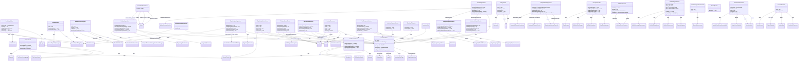

# Infection System

> Virus spreading and scenario management.

**84 classes**

## Key Classes

## Class Diagram

```mermaid
classDiagram
    class BoobytrapHelper {
        +selectTrap(...) TrapSelection
        +spread(...) int
        +triggerExplosion(...) void
        +debugList(...) void
        +placeTrap(...) BlockPos
    }
    class InfectionOperations {
        +ensureDebugInfection(...) void
        +applyDifficultyRules(...) void
        +broadcast(...) void
        +getSingularitySnapshot() Optional
        +applySingularitySnapshot(...) void
    }
    class VirusDamageClassifier {
        +KEY_BED: String
        +KEY_TNT: String
        +KEY_EXPLOSION: String
        +KEY_MELEE_PREFIX: String
        +classify(...) String
        +classifyExplosion(...) String
        +getDisplayName(...) String
    }
    class VirusItemAlerts {
        +init() void
        +broadcastBurn(...) void
        +broadcastPickup(...) void
    }
    class VirusInventoryAnnouncements {
        +init() void
        +tick(...) void
    }
    class GlobalTerrainCorruption {
        +init() void
        +trigger(...) void
        +cleanse(...) void
        +getTrackedChunkCount(...) int
    }
    class CorruptionProfiler {
        +logChunkRewrite(...) void
        +logBoobytrapPlacement(...) void
        +logBoobytrapSpread(...) void
        +logBoobytrapTrigger(...) void
        +logMatrixCubeSkip(...) void
    }
    class VirusWorldPersistence {
        +CODEC: Codec
    }
    class VirusTierBossBar {
        +init() void
        +update(...) void
    }
    class CollapseOperations {
        +createBorderSyncData(...)
        +hasCollapseWorkRemaining() boolean
        +transitionSingularityState(...) void
        +tryCompleteCollapse(...) boolean
        +computeInitialCollapseRadius(...) int
    }
    class VirusWorldState {
        +ID: String
        +TYPE: PersistentStateType
        +get(...) VirusWorldState
        +world() ServerWorld
        +singularity() SingularityModule
        +singularityState()
        +collapseModule() CollapseModule
    }
    class TierCookbook {
        +isEnabled(...) boolean
        +anyEnabled(...) boolean
        +activeFeatures(...) EnumSet
        +defaultPlan() EnumMap
    }
    class CollapseSnapshotService {
        +buildSingularitySnapshot() Optional
        +buildBorderSnapshot() Optional
        +applySingularitySnapshot(...) void
        +applySingularityBorderSnapshot(...) void
    }
    class InfectionLifecycleService {
        +captureBoobytrapDefaults() void
        +disableBoobytraps() void
        +restoreBoobytrapRules() void
        +beginCleansing() void
        +ensureDebugInfection(...) void
    }
    class ConfigService {
        +root() Path
        +resolve(...) Path
        +readJson(...) T
        +writeJson(...) void
        +exists(...) boolean
    }
    class VirusBlockTelemetryService {
        +tick() void
    }
    class SingularityFusingService {
        +beginFusing(...) void
        +handleSingularityInactive() void
        +emitFuseEffects() void
        +maintainFuseEntities() void
        +clearFuseEntities() void
    }
    class SingularityBarrierService {
        +state() State
        +tick(...) void
        +deactivate() void
        +reset() void
        +resetTimers() void
    }
    class InfectionServices {
        +initialize(...) void
        +reload() void
        +get() InfectionServiceContainer
        +container() InfectionServiceContainer
    }
    class CollapseQueueService {
        +chunkQueue() Deque
        +chunkQueueSnapshot() List
        +resetQueue() Deque
        +resetQueueSnapshot() List
        +clearResetProcessed() void
    }
    class SourceControlService {
        +maybeTeleportSources() boolean
        +spawnCoreGuardians() void
        +forceContainmentReset() void
        +endInfection() void
    }
    class AlertingService {
        +dispatch(...) void
    }
    class CollapseProcessor {
        +state() State
        +start(...) void
        +start(...) void
        +stop() void
        +isActive() boolean
    }
    class VirusSchedulerService {
        +scheduler() VirusScheduler
        +install(...) void
        +tick() void
        +snapshot() List
        +loadSnapshot(...) void
    }
    class ShellRebuildService {
        +shellsCollapsed(...) boolean
        +setShellsCollapsed(...) void
        +shellRebuildPending(...) boolean
        +setShellRebuildPending(...) void
        +clearCooldowns(...) void
    }
    class TierProgressionService {
        +advanceTier() void
        +forceAdvanceTier() boolean
        +applyContainmentCharge(...) void
        +reduceMaxHealth(...) boolean
        +bleedHealth(...) boolean
    }
    class InfectionExposureService {
        +tickContact() void
        +tickInventory() void
    }
    class CollapseWatchdogService {
        +controller() SingularityWatchdogController
        +resetCollapseStallTicks() void
        +collapseStallTicks() int
        +diagnosticsSampleInterval() int
        +presentationService() SingularityPresentationService
    }
    class EffectBusTelemetry {
        +onRegister(...) void
        +onUnregister(...) void
    }
    class PersistentState
    class Codec
    class T
    class Objectvalue
    class State
    class Deque
    class Statestate
    class Callbackscallbacks
    class Blockblock
    BoobytrapHelper --> BlockStatestate : uses
    BoobytrapHelper --> ServerPlayerEntityplayer : uses
    BoobytrapHelper --> TrapSelection : returns
    BoobytrapHelper --> Typetype : uses
    CollapseOperations --> CollapseBroadcastManagerbroadcastManager : uses
    CollapseOperations --> SingularityPhaseService : singularityPhaseService
    CollapseOperations --> SingularityStatenext : uses
    CollapseOperations --> VirusWorldState : state
    CollapseProcessor --> Deque : deferredDrainQueue
    CollapseProcessor --> State : returns
    CollapseProcessor --> State : state
    CollapseProcessor --> VirusWorldState : host
    CollapseQueueService --> Deque : chunkQueue
    CollapseQueueService --> Deque : resetQueue
    CollapseQueueService --> PreCollapseDrainageJob : preCollapseDrainageJob
    CollapseQueueService --> VirusWorldState : host
    CollapseSnapshotService --> SingularityBorderSnapshot : returns
    CollapseSnapshotService --> SingularitySnapshot : returns
    CollapseSnapshotService --> SingularitySnapshotsnapshot : uses
    CollapseSnapshotService --> VirusWorldState : host
    CollapseWatchdogService --> SingularityPresentationService : presentationFallback
    CollapseWatchdogService --> SingularityTelemetryService : FALLBACK_TELEMETRY
    CollapseWatchdogService --> SingularityWatchdogController : returns
    CollapseWatchdogService --> SingularityWatchdogController : watchdogController
    ConfigService --> Objectvalue : uses
    ConfigService --> T : returns
    ConfigService --> T : uses
    CorruptionProfiler --> ChunkPospos : uses
    CorruptionProfiler --> NullableBlockPospos : uses
    CorruptionProfiler --> NullableStringdetail : uses
    CorruptionProfiler --> VirusEventTypetype : uses
    EffectBusTelemetry --> VirusWorldState : state
    GlobalTerrainCorruption --> BlockStatestate : uses
    GlobalTerrainCorruption --> ChunkWorkTracker : TRACKERS
    GlobalTerrainCorruption --> ChunkWorkTracker : returns
    GlobalTerrainCorruption --> ChunkWorkTrackertracker : uses
    InfectionExposureService --> VirusWorldState : host
    InfectionLifecycleService --> VirusWorldState : host
    InfectionOperations --> AmbientPressureService : ambientPressureService
    InfectionOperations --> CollapseSnapshotService : snapshotService
    InfectionOperations --> InfectionLifecycleService : infectionLifecycleService
    InfectionOperations --> VirusWorldState : state
    InfectionServices --> InfectionServiceContainer : INSTANCE
    InfectionServices --> InfectionServiceContainer : returns
    PersistentState <|-- VirusWorldState
    ShellRebuildService --> Blockblock : uses
    ShellRebuildService --> Callbackscallbacks : uses
    ShellRebuildService --> InfectionTiertier : uses
    ShellRebuildService --> Statestate : uses
    SingularityBarrierService --> InfectionTiertier : uses
    SingularityBarrierService --> State : returns
    SingularityBarrierService --> State : state
    SingularityBarrierService --> VirusWorldState : host
    SingularityFusingService --> BlockStatestate : uses
    SingularityFusingService --> DustColorTransitionParticleEffect : SINGULARITY_FUSE_GLOW
    SingularityFusingService --> SingularityContextctx : uses
    SingularityFusingService --> VirusWorldState : host
    SourceControlService --> ShellRebuildService : shellService
    SourceControlService --> VirusSourceService : sourceService
    SourceControlService --> VirusWorldState : host
    TierCookbook --> EnumSet : returns
    TierCookbook --> InfectionTiertier : uses
    TierCookbook --> TierFeatureGroupgroup : uses
    TierCookbook --> TierFeaturefeature : uses
    TierProgressionService --> ShellRebuildService : shellService
    TierProgressionService --> SingularityLifecycleService : lifecycle
    TierProgressionService --> TierModule : tiers
    TierProgressionService --> VirusWorldState : host
    VirusBlockTelemetryService --> ServerPlayerEntityplayer : uses
    VirusBlockTelemetryService --> VirusWorldState : host
    VirusDamageClassifier --> NullableDamageSourcesource : uses
    VirusDamageClassifier --> NullableEntityattacker : uses
    VirusDamageClassifier --> NullableEntitysource : uses
    VirusDamageClassifier --> PlayerEntityplayer : uses
    VirusInventoryAnnouncements --> MinecraftServerserver : uses
    VirusItemAlerts --> ServerPlayerEntitydropper : uses
    VirusItemAlerts --> ServerPlayerEntityplayer : uses
    VirusSchedulerService --> NullableVirusSchedulerscheduler : uses
    VirusSchedulerService --> SimpleVirusScheduler : fallback
    VirusSchedulerService --> VirusScheduler : active
    VirusSchedulerService --> VirusScheduler : returns
    VirusTierBossBar --> BossBarsbars : uses
    VirusTierBossBar --> Object2ByteMap : SKY_TINT
    VirusTierBossBar --> RegistryKey : BARS
    VirusTierBossBar --> VirusWorldStatestate : uses
    VirusWorldPersistence --> Codec : BOOBYTRAP_CODEC
    VirusWorldPersistence --> Codec : CODEC
    VirusWorldPersistence --> Codec : SHIELD_FIELD_CODEC
    VirusWorldPersistence --> Codec : SPREAD_CODEC
    VirusWorldState --> InfectionState : infectionState
    VirusWorldState --> LongSet : pillarChunks
    VirusWorldState --> PersistentStateType : TYPE
    VirusWorldState --> SingularityModule : singularityModule
```

---
[Back to README](./README.md)
