# Visual System

> Shapes, patterns, colors, animations, and fill modes.

**125 classes**

## Key Classes

- **`Shape`** (interface)
- **`QuadPattern`** (enum)
- **`TrianglePattern`** (enum)
- **`ColorTheme`** (class)
- **`FillConfig`** (record)
- **`FillMode`** (enum)

## Class Diagram

```mermaid
classDiagram
    class AtomDistribution {
        <<enumeration>>
    }
    class CapsuleShape {
        <<record>>
        +radius: float
        +height: float
        +segments: int
        +rings: int
        +of(...) CapsuleShape
        +getType() String
        +getBounds() Vector3f
        +primaryCellType() CellType
        +getParts() Map
    }
    class ConeShape {
        <<record>>
        +bottomRadius: float
        +topRadius: float
        +height: float
        +segments: int
        +of(...) ConeShape
        +frustum(...) ConeShape
        +getType() String
        +getBounds() Vector3f
        +primaryCellType() CellType
    }
    class CylinderShape {
        <<record>>
        +radius: float
        +height: float
        +segments: int
        +topRadius: float
        +defaults() CylinderShape
        +thin(...) CylinderShape
        +of(...) CylinderShape
        +tapered(...) CylinderShape
        +tube(...) CylinderShape
    }
    class EdgeTransitionMode {
        <<enumeration>>
    }
    class FieldDeformationMode {
        <<enumeration>>
    }
    class JetPrecession {
        <<record>>
        +enabled: boolean
        +tiltAngle: float
        +speed: float
        +phase: float
        +defaults() JetPrecession
        +of(...) JetPrecession
        +withPhase(...) JetPrecession
        +isActive() boolean
        +getCurrentAngle(...) float
    }
    class JetShape {
        <<record>>
        +length: float
        +baseRadius: float
        +topTipRadius: float
        +bottomTipRadius: float
        +defaults() JetShape
        +cone(...) JetShape
        +tube(...) JetShape
        +asymmetric(...) JetShape
        +getType() String
    }
    class KamehamehaShape {
        <<record>>
        +orbTransition: TransitionStyle
        +orbRadius: float
        +orbSegments: int
        +orbProgress: float
        +defaults() KamehamehaShape
        +getType() String
        +getBounds() Vector3f
        +primaryCellType() CellType
        +getParts() Map
    }
    class MoleculeShape {
        <<record>>
        +atomCount: int
        +atomRadius: float
        +atomDistance: float
        +neckRadius: float
        +of(...) MoleculeShape
        +of(...) MoleculeShape
        +getType() String
        +getBounds() Vector3f
        +primaryCellType() CellType
    }
    class OrientationAxis {
        <<enumeration>>
    }
    class PolyhedronShape {
        <<record>>
        +polyType: PolyType
        +radius: float
        +subdivisions: int
        +DEFAULT: PolyhedronShape
        +cube(...) PolyhedronShape
        +octahedron(...) PolyhedronShape
        +dodecahedron(...) PolyhedronShape
        +tetrahedron(...) PolyhedronShape
        +icosahedron(...) PolyhedronShape
    }
    class PolyType {
        <<enumeration>>
    }
    class PrismShape {
        <<record>>
        +sides: int
        +radius: float
        +height: float
        +topRadius: float
        +of(...) PrismShape
        +tapered(...) PrismShape
        +getType() String
        +getBounds() Vector3f
        +primaryCellType() CellType
    }
    class RayArrangement {
        <<enumeration>>
    }
    class RayCurvature {
        <<enumeration>>
    }
    class RayDistribution {
        <<enumeration>>
    }
    class RayFlowStage {
        <<enumeration>>
    }
    class RayLayerMode {
        <<enumeration>>
    }
    class RayLineShape {
        <<enumeration>>
    }
    class RayOrientation {
        <<enumeration>>
    }
    class RaysShape {
        <<record>>
        +rayLength: float
        +rayWidth: float
        +count: int
        +arrangement: RayArrangement
        +defaults() RaysShape
        +radial(...) RaysShape
        +spherical(...) RaysShape
        +converging(...) RaysShape
        +getType() String
    }
    class RayType {
        <<enumeration>>
    }
    class RingShape {
        <<record>>
        +innerRadius: float
        +outerRadius: float
        +segments: int
        +heightSegments: int
        +at(...) RingShape
        +effectiveOrientation() OrientationAxis
        +getType() String
        +getBounds() Vector3f
        +primaryCellType() CellType
    }
    class Shape {
        <<interface>>
    }
    class ShapeMath {
        +sphere(...) float
        +droplet(...) float
        +egg(...) float
        +bullet(...) float
        +cone(...) float
    }
    class ShapeRegistry {
        +register(...) void
        +registerSimple(...) void
        +create(...) Shape
        +create(...) Shape
        +create(...) Shape
    }
    class ShapeStage {
        <<interface>>
    }
    class ShapeState {
        <<record>>
        +stage: S
        +phase: float
        +edgeMode: EdgeTransitionMode
        +edgeIntensity: float
        +withStage(...) ShapeState
        +withPhase(...) ShapeState
        +withEdgeMode(...) ShapeState
        +withEdgeIntensity(...) ShapeState
        +isVisible() boolean
    }
    class SimplexNoise {
        +noise3D(...) float
        +noise3D(...) float
        +fBm(...) float
        +fBm(...) float
        +ridgedMultifractal(...) float
    }
    class Builder
    class RADIUSfloatradius
    class POSITIVE_NONZEROfloatheight
    class STEPSintsubdivisions
    class SIDESintsides
    class UNBOUNDEDfloaty
    class S
    CapsuleShape --> Builder : returns
    CapsuleShape --> CellType : returns
    CapsuleShape --> Vector3f : returns
    ConeShape --> Builder : returns
    ConeShape --> CellType : returns
    ConeShape --> Vector3f : returns
    CylinderShape --> POSITIVE_NONZEROfloatheight : uses
    CylinderShape --> POSITIVEfloattopRadius : uses
    CylinderShape --> RADIUSfloatradius : uses
    CylinderShape --> Vector3f : returns
    JetPrecession --> Builder : returns
    JetShape --> Builder : returns
    JetShape --> CellType : returns
    JetShape --> Vector3f : returns
    KamehamehaShape --> OrientationAxis : orientationAxis
    KamehamehaShape --> TransitionStyle : beamTransition
    KamehamehaShape --> TransitionStyle : orbTransition
    KamehamehaShape --> Vector3f : returns
    MoleculeShape --> AtomDistribution : distribution
    MoleculeShape --> Builder : returns
    MoleculeShape --> CellType : returns
    MoleculeShape --> Vector3f : returns
    PolyhedronShape --> PolyType : polyType
    PolyhedronShape --> PolyTypetype : uses
    PolyhedronShape --> RADIUSfloatradius : uses
    PolyhedronShape --> STEPSintsubdivisions : uses
    PrismShape --> POSITIVE_NONZEROfloatheight : uses
    PrismShape --> POSITIVEfloattopRadius : uses
    PrismShape --> RADIUSfloatradius : uses
    PrismShape --> SIDESintsides : uses
    RaysShape --> RayArrangement : arrangement
    RaysShape --> RayDistribution : distribution
    RaysShape --> RayLayerMode : layerMode
    RaysShape --> RayLineShape : lineShape
    RingShape --> OrientationAxis : orientation
    RingShape --> RADIUSfloatinnerRadius : uses
    RingShape --> RADIUSfloatouterRadius : uses
    RingShape --> UNBOUNDEDfloaty : uses
    Shape --> CellType : returns
    Shape --> Vector3f : returns
    Shape <|.. CapsuleShape
    Shape <|.. ConeShape
    Shape <|.. CylinderShape
    Shape <|.. JetShape
    Shape <|.. KamehamehaShape
    Shape <|.. MoleculeShape
    Shape <|.. PolyhedronShape
    Shape <|.. PrismShape
    Shape <|.. RaysShape
    Shape <|.. RingShape
    ShapeMath --> CloudStylestyle : uses
    ShapeRegistry --> Shape : returns
    ShapeRegistry --> Shape : uses
    ShapeRegistry --> ShapeFactory : FACTORIES
    ShapeRegistry --> ShapeFactoryfactory : uses
    ShapeStage <|.. RayFlowStage
    ShapeState --> EdgeTransitionMode : edgeMode
    ShapeState --> S : returns
    ShapeState --> S : stage
    ShapeState --> SnewStage : uses
```

---
[Back to README](./README.md)
